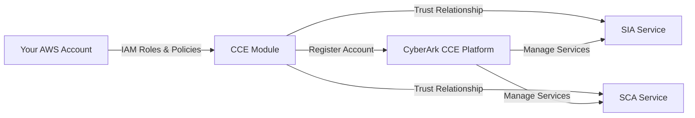

# CyberArk CCE AWS Account Onboarding Module

## Overview

This Terraform module simplifies the onboarding of AWS accounts to **CyberArk's Connect Cloud Environments (CCE)** SaaS platform. It automates the creation of necessary AWS IAM resources and establishes trust relationships with CyberArk services, enabling seamless integration in a single deployment.

The module supports multiple CyberArk CCE services that can be enabled independently or together:
- **SIA (Secure Infrastructure Access)** - Provides just-in-time privileged access to infrastructure resources
- **SCA (Secure Cloud Access)** - Enables secure cloud entitlements management with optional AWS IAM Identity Center (SSO) integration



## Features

- **Automated IAM Setup**: Creates and configures IAM roles and policies required for CyberArk CCE services
- **Multi-Service Support**: Enable SIA and/or SCA services based on your needs
- **SSO Integration**: Optional AWS IAM Identity Center integration for SCA
- **Security Best Practices**: Implements least-privilege access with external ID validation
- **Idempotent**: Safe to run multiple times
- **Production Ready**: Includes validation, error handling, and comprehensive outputs

## Architecture

The module creates the following resources in your AWS account:

### For SIA (Secure Infrastructure Access)
- IAM Role: `CyberArkDynamicPrivilegedAccess-{tenant-id}`
- IAM Policy: `CyberarkJitAccountProvisioningPolicy-{tenant-id}`
- Permissions: EC2 instance and region discovery

### For SCA (Secure Cloud Access)
- IAM Role: `CyberArkRoleSCATerraform-{account-id}`
- IAM Policy: `CyberArkPolicyAccountForSCATerraform-{account-id}`
- Optional IAM Policy (if SSO enabled): `CyberArkPolicySSOForSCATerraform-{account-id}`
- Permissions: IAM role management, SAML provider management, optional SSO permissions

## Prerequisites

Before using this module, ensure you have:

1. **Terraform** >= 1.8.5 installed
2. **AWS Credentials** configured with permissions to create:
   - IAM roles and policies
   - IAM role policy attachments
   - (Optional for SCA SSO) AWS IAM Identity Center permissions
3. **CyberArk CCE Tenant** with access credentials for the `idsec` provider
4. **AWS Account ID** you want to onboard

## Usage

### Basic Example - SCA Only

```hcl
terraform {
  required_providers {
    aws = {
      source  = "hashicorp/aws"
      version = "~> 5.0"
    }
    idsec = {
      source  = "cyberark/idsec"
      version = "~> 1.0"
    }
  }
}

provider "aws" {
  region = "us-east-1"
}

provider "idsec" {
  # Configure with your CyberArk CCE tenant credentials
  # See: https://registry.terraform.io/providers/cyberark/idsec/latest/docs
}

module "cce_onboarding" {
  source = "path/to/terraform-aws-cce-account"

  account_id           = "123456789012"
  account_display_name = "Production AWS Account"

  # Enable only SCA service
  sca = {
    enable     = true
    sso_enable = false
  }

  # Disable SIA service
  sia = null
}

output "sca_role_arn" {
  value = module.cce_onboarding.sca_role_arn
}
```

### Complete Example - All Services with SSO

```hcl
module "cce_onboarding" {
  source = "path/to/terraform-aws-cce-account"

  account_id           = "123456789012"
  account_display_name = "Production AWS Account"

  # Enable SIA service
  sia = {
    enable = true
  }

  # Enable SCA service with SSO
  sca = {
    enable     = true
    sso_enable = true
    sso_region = "us-east-1"
  }
}

output "sia_role_arn" {
  value = module.cce_onboarding.sia_role_arn
}

output "sca_role_arn" {
  value = module.cce_onboarding.sca_role_arn
}

output "enabled_services" {
  value = module.cce_onboarding.enabled_services
}
```

## Service Configuration

### SIA (Secure Infrastructure Access)

SIA provides just-in-time privileged access to your infrastructure resources. To enable:

```hcl
sia = {
  enable = true
}
```

**Note**: Internally, the SIA service uses the name "dpa" (Dynamic Privileged Access) for backward compatibility with existing deployments.

### SCA (Secure Cloud Access)

SCA enables secure cloud entitlements management. Configuration options:

```hcl
# Basic SCA without SSO
sca = {
  enable     = true
  sso_enable = false
}

# SCA with AWS IAM Identity Center (SSO) integration
sca = {
  enable     = true
  sso_enable = true
  sso_region = "us-east-1"  # Required when sso_enable is true
}
```

## Inputs

| Name | Description | Type | Default | Required |
|------|-------------|------|---------|:--------:|
| account_id | The AWS account ID to onboard to CyberArk CCE. Must be a valid 12-digit AWS account ID. | `string` | n/a | yes |
| account_display_name | The display name for the AWS account in CyberArk CCE | `string` | `"AWS Account"` | no |
| sia | Configuration for the SIA (Secure Infrastructure Access) feature. Note: Uses DPA service internally for backward compatibility. | `object({ enable = optional(bool, true) })` | `null` | no |
| sca | Configuration for the SCA (Secure Cloud Access) feature. When sso_enable is true, sso_region must be specified. | `object({ enable = optional(bool, true), sso_enable = optional(bool, false), sso_region = optional(string, null) })` | `null` | no |

## Outputs

| Name | Description |
|------|-------------|
| account_id | The AWS account ID that was onboarded to CyberArk CCE |
| account_display_name | The display name of the AWS account in CyberArk CCE |
| deployment_region | The AWS region where resources were deployed |
| sia_role_arn | The ARN of the IAM role created for SIA service. Returns null if SIA is not enabled. |
| sca_role_arn | The ARN of the IAM role created for SCA service. Returns null if SCA is not enabled. |
| sca_sso_enabled | Whether SSO/Identity Center integration is enabled for SCA. Returns null if SCA is not enabled. |
| enabled_services | List of CyberArk CCE services that were enabled for this account |

## Examples

See the [examples](./examples) directory for complete, working examples:

- **[basic](./examples/basic/)** - Basic SCA-only deployment
- **[complete](./examples/complete/)** - All services enabled with SSO integration

## IAM Permissions Required

The AWS credentials used to run this module need the following permissions:

```json
{
  "Version": "2012-10-17",
  "Statement": [
    {
      "Effect": "Allow",
      "Action": [
        "iam:CreateRole",
        "iam:DeleteRole",
        "iam:GetRole",
        "iam:CreatePolicy",
        "iam:DeletePolicy",
        "iam:GetPolicy",
        "iam:AttachRolePolicy",
        "iam:DetachRolePolicy",
        "iam:ListAttachedRolePolicies",
        "iam:TagRole",
        "iam:UntagRole"
      ],
      "Resource": "*"
    }
  ]
}
```

For SCA with SSO enabled, additional Identity Center permissions are required.

## Security Considerations

- **External ID Validation**: All cross-account role assumptions use external ID validation to prevent confused deputy attacks
- **Least Privilege**: IAM policies grant only the minimum permissions required for each service
- **Trust Policies**: Roles can only be assumed by verified CyberArk service accounts with proper conditions
- **Regional Deployment**: Resources are deployed in the region specified by your AWS provider configuration

## Troubleshooting

### Issue: "The account_id must be a valid 12-digit AWS account ID"
**Solution**: Ensure your `account_id` variable contains exactly 12 digits without any spaces or special characters.

### Issue: "When sso_enable is true, sso_region must be specified"
**Solution**: If you're enabling SSO for SCA, you must provide the `sso_region` parameter:
```hcl
sca = {
  enable     = true
  sso_enable = true
  sso_region = "us-east-1"
}
```

### Issue: Provider authentication errors
**Solution**: Ensure your `idsec` provider is correctly configured with valid CyberArk CCE credentials. Refer to the [provider documentation](https://registry.terraform.io/providers/cyberark/idsec/latest/docs).

## Versioning

This module follows [Semantic Versioning](https://semver.org/). Current version: **0.1.0**

## Licensing

This repository is subject to the following licenses:
- **CyberArk Privileged Access Manager**: Licensed under the [CyberArk Software EULA](https://www.cyberark.com/EULA.pdf)
- **Terraform templates**: Licensed under the Apache License, Version 2.0 ([LICENSE](LICENSE))

## Contributing

We welcome contributions! Please see our [Contributing Guidelines](CONTRIBUTING.md) for more details.

## Support

For issues related to this Terraform module, please open an issue in this repository.

For CyberArk CCE platform support, please contact CyberArk Support.

## About CyberArk

CyberArk is a global leader in **Identity Security**, providing powerful solutions for managing privileged access and securing cloud environments. Learn more at [www.cyberark.com](https://www.cyberark.com).
